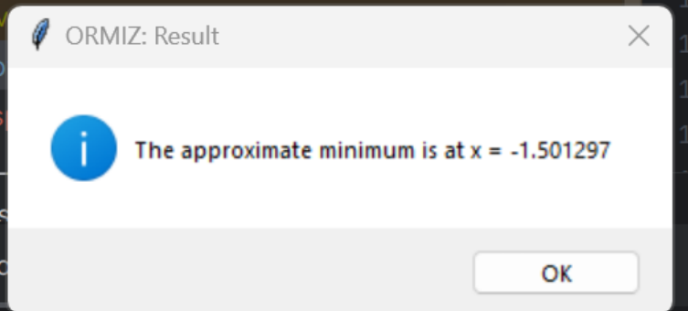

# Dichotomy Minimization Method

This project implements the **Dichotomy Method** for unconstrained minimization of a given function. The program is designed with a user-friendly interface and provides live graph updates as the minimization process progresses.

## Features
- **Interactive User Interface**: Users can input the lower bound (a), upper bound (b), precision (epsilon), and the function they wish to minimize.
- **Dynamic Graph Visualization**: As the minimization process runs, it updates the graph in real-time, showing the function, the current interval, and the midpoint.
- **Editable Function**: Users can enter and modify the function to be minimized directly through the interface.
- **Process Interruption**: The minimization process can be stopped at any point without losing the current result.
- **Warnings and Suggestions**: If the process is running too many iterations or the epsilon is too small, the user will be prompted to make adjustments.
- **Graphical Representation of Iterations**: The graphical output includes live updates of the interval narrowing, with the boundaries and midpoint plotted at each step.

## How to Use

1. **Install the Required Libraries**:
   You need the following Python libraries to run the program:
   ```bash
   pip install tkinter matplotlib numpy
2. **Running the Program**:
   - Clone the repository:
     ```bash
     git clone https://github.com/hallame/dichotomy_method
     cd dichotomy_method
     ```
   - Run the Python script:
     ```bash
     python main.py
     ```
   - Alternatively, if you have the `.exe` file, simply double-click to run the program on a Windows machine. No installation required.
## Input Values
- **Lower Bound (a)**: The left endpoint of the interval where the function is defined. It must be less than the upper bound.
- **Upper Bound (b)**: The right endpoint of the interval. It must be greater than the lower bound.
- **Precision (epsilon)**: The desired accuracy of the minimization. A smaller value will lead to a more accurate result but may take longer to compute.
- **Function**: The mathematical function to minimize. Enter it as a Python expression (e.g., `x**2 + 3*x + 3`). The function must be unimodal in the interval [a, b] for the method to work correctly.

## Output
- The program provides graphical output showing the function curve and the iterative process of finding the minimum. The graph updates in real-time, displaying:
  - The function being minimized in blue.
  - Vertical dashed lines representing the current interval boundaries (red for lower bound and green for upper bound).
  - A black dot marking the current midpoint where the function is evaluated.
- At the end of the minimization, a pop-up window displays the approximate minimum value found, along with the corresponding \(x\) value.

## Example
For example, to minimize the function:

\[ f(x) = x^2 + 3x + 3 \]

### Analytical Solution:
To find the minimum of the function \( f(x) = x^2 + 3x + 3 \), we first take its derivative:

\[
f'(x) = 2x + 3
\]

Set the derivative to zero to find the critical points:

\[
2x + 3 = 0 \quad \Rightarrow \quad x = -\frac{3}{2} = -1.5
\]

At \( x = -1.5 \), we compute the function value:

\[
f(-1.5) = (-1.5)^2 + 3(-1.5) + 3 = 2.25 - 4.5 + 3 = 0.75
\]

Thus, the minimum value is approximately \( f(x) = 0.75 \) at \( x = -1.5 \).

## Screenshots

### 1. Initial Input Window


### 2. Graphical Output During Iteration


### 3. Final Result Window


